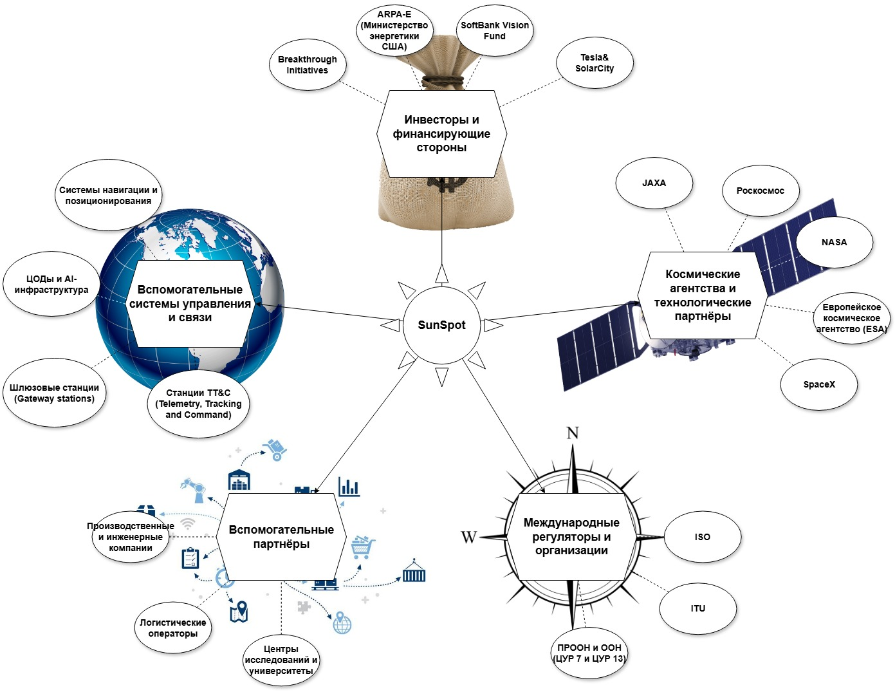

  

  
Sun in your pocket.

  

      
      
  

---  

## Содержание:
<!-- START doctoc generated TOC please keep comment here to allow auto update -->
<!-- DON'T EDIT THIS SECTION, INSTEAD RE-RUN doctoc TO UPDATE -->

- [Введение](#%D0%92%D0%B2%D0%B5%D0%B4%D0%B5%D0%BD%D0%B8%D0%B5)
- [Использование](#%D0%98%D1%81%D0%BF%D0%BE%D0%BB%D1%8C%D0%B7%D0%BE%D0%B2%D0%B0%D0%BD%D0%B8%D0%B5)
- [Технология](#%D0%A2%D0%B5%D1%85%D0%BD%D0%BE%D0%BB%D0%BE%D0%B3%D0%B8%D1%8F)
- [Цели стартапа](#%D0%A6%D0%B5%D0%BB%D0%B8-%D1%81%D1%82%D0%B0%D1%80%D1%82%D0%B0%D0%BF%D0%B0)
- [Команда](#%D0%9A%D0%BE%D0%BC%D0%B0%D0%BD%D0%B4%D0%B0)
- [Конкуренты](#%D0%9A%D0%BE%D0%BD%D0%BA%D1%83%D1%80%D0%B5%D0%BD%D1%82%D1%8B)
  - [Похожие проекты](#%D0%9F%D0%BE%D1%85%D0%BE%D0%B6%D0%B8%D0%B5-%D0%BF%D1%80%D0%BE%D0%B5%D0%BA%D1%82%D1%8B)
  - [Прямые конкуренты](#%D0%9F%D1%80%D1%8F%D0%BC%D1%8B%D0%B5-%D0%BA%D0%BE%D0%BD%D0%BA%D1%83%D1%80%D0%B5%D0%BD%D1%82%D1%8B)
  - [Отличие SunSpot от конкурентов](#%D0%9E%D1%82%D0%BB%D0%B8%D1%87%D0%B8%D0%B5-sunspot-%D0%BE%D1%82-%D0%BA%D0%BE%D0%BD%D0%BA%D1%83%D1%80%D0%B5%D0%BD%D1%82%D0%BE%D0%B2)
- [Основные бизнес-процессы](#%D0%9E%D1%81%D0%BD%D0%BE%D0%B2%D0%BD%D1%8B%D0%B5-%D0%B1%D0%B8%D0%B7%D0%BD%D0%B5%D1%81-%D0%BF%D1%80%D0%BE%D1%86%D0%B5%D1%81%D1%81%D1%8B)
  - [Проектирование спутников](#%D0%9F%D1%80%D0%BE%D0%B5%D0%BA%D1%82%D0%B8%D1%80%D0%BE%D0%B2%D0%B0%D0%BD%D0%B8%D0%B5-%D1%81%D0%BF%D1%83%D1%82%D0%BD%D0%B8%D0%BA%D0%BE%D0%B2)
  - [Производство спутников](#%D0%9F%D1%80%D0%BE%D0%B8%D0%B7%D0%B2%D0%BE%D0%B4%D1%81%D1%82%D0%B2%D0%BE-%D1%81%D0%BF%D1%83%D1%82%D0%BD%D0%B8%D0%BA%D0%BE%D0%B2)
  - [Запуск и развертывание спутниковой группировки](#%D0%97%D0%B0%D0%BF%D1%83%D1%81%D0%BA-%D0%B8-%D1%80%D0%B0%D0%B7%D0%B2%D0%B5%D1%80%D1%82%D1%8B%D0%B2%D0%B0%D0%BD%D0%B8%D0%B5-%D1%81%D0%BF%D1%83%D1%82%D0%BD%D0%B8%D0%BA%D0%BE%D0%B2%D0%BE%D0%B9-%D0%B3%D1%80%D1%83%D0%BF%D0%BF%D0%B8%D1%80%D0%BE%D0%B2%D0%BA%D0%B8)
  - [Управление спутниками и оптимизация их работы](#%D0%A3%D0%BF%D1%80%D0%B0%D0%B2%D0%BB%D0%B5%D0%BD%D0%B8%D0%B5-%D1%81%D0%BF%D1%83%D1%82%D0%BD%D0%B8%D0%BA%D0%B0%D0%BC%D0%B8-%D0%B8-%D0%BE%D0%BF%D1%82%D0%B8%D0%BC%D0%B8%D0%B7%D0%B0%D1%86%D0%B8%D1%8F-%D0%B8%D1%85-%D1%80%D0%B0%D0%B1%D0%BE%D1%82%D1%8B)
  - [Прием и обработка заказов от пользователей](#%D0%9F%D1%80%D0%B8%D0%B5%D0%BC-%D0%B8-%D0%BE%D0%B1%D1%80%D0%B0%D0%B1%D0%BE%D1%82%D0%BA%D0%B0-%D0%B7%D0%B0%D0%BA%D0%B0%D0%B7%D0%BE%D0%B2-%D0%BE%D1%82-%D0%BF%D0%BE%D0%BB%D1%8C%D0%B7%D0%BE%D0%B2%D0%B0%D1%82%D0%B5%D0%BB%D0%B5%D0%B9)
  - [Оказание услуги освещения](#%D0%9E%D0%BA%D0%B0%D0%B7%D0%B0%D0%BD%D0%B8%D0%B5-%D1%83%D1%81%D0%BB%D1%83%D0%B3%D0%B8-%D0%BE%D1%81%D0%B2%D0%B5%D1%89%D0%B5%D0%BD%D0%B8%D1%8F)
  - [Техническая поддержка](#%D0%A2%D0%B5%D1%85%D0%BD%D0%B8%D1%87%D0%B5%D1%81%D0%BA%D0%B0%D1%8F-%D0%BF%D0%BE%D0%B4%D0%B4%D0%B5%D1%80%D0%B6%D0%BA%D0%B0)
  - [Маркетинг и продвижение](#%D0%9C%D0%B0%D1%80%D0%BA%D0%B5%D1%82%D0%B8%D0%BD%D0%B3-%D0%B8-%D0%BF%D1%80%D0%BE%D0%B4%D0%B2%D0%B8%D0%B6%D0%B5%D0%BD%D0%B8%D0%B5)
- [Заинтерисованные лица](#%D0%97%D0%B0%D0%B8%D0%BD%D1%82%D0%B5%D1%80%D0%B8%D1%81%D0%BE%D0%B2%D0%B0%D0%BD%D0%BD%D1%8B%D0%B5-%D0%BB%D0%B8%D1%86%D0%B0)
  - [Потребности](#%D0%9F%D0%BE%D1%82%D1%80%D0%B5%D0%B1%D0%BD%D0%BE%D1%81%D1%82%D0%B8)
  - [Требования](#%D0%A2%D1%80%D0%B5%D0%B1%D0%BE%D0%B2%D0%B0%D0%BD%D0%B8%D1%8F)
- [Требования системы](#%D0%A2%D1%80%D0%B5%D0%B1%D0%BE%D0%B2%D0%B0%D0%BD%D0%B8%D1%8F-%D1%81%D0%B8%D1%81%D1%82%D0%B5%D0%BC%D1%8B)
  - [Функциональные требования](#%D0%A4%D1%83%D0%BD%D0%BA%D1%86%D0%B8%D0%BE%D0%BD%D0%B0%D0%BB%D1%8C%D0%BD%D1%8B%D0%B5-%D1%82%D1%80%D0%B5%D0%B1%D0%BE%D0%B2%D0%B0%D0%BD%D0%B8%D1%8F)
  - [Нефункциональные требования](#%D0%9D%D0%B5%D1%84%D1%83%D0%BD%D0%BA%D1%86%D0%B8%D0%BE%D0%BD%D0%B0%D0%BB%D1%8C%D0%BD%D1%8B%D0%B5-%D1%82%D1%80%D0%B5%D0%B1%D0%BE%D0%B2%D0%B0%D0%BD%D0%B8%D1%8F)
- [Границы системы](#%D0%93%D1%80%D0%B0%D0%BD%D0%B8%D1%86%D1%8B-%D1%81%D0%B8%D1%81%D1%82%D0%B5%D0%BC%D1%8B)
  - [Внешние системы](#%D0%92%D0%BD%D0%B5%D1%88%D0%BD%D0%B8%D0%B5-%D1%81%D0%B8%D1%81%D1%82%D0%B5%D0%BC%D1%8B)
  - [Обмен данными с внешними системами](#%D0%9E%D0%B1%D0%BC%D0%B5%D0%BD-%D0%B4%D0%B0%D0%BD%D0%BD%D1%8B%D0%BC%D0%B8-%D1%81-%D0%B2%D0%BD%D0%B5%D1%88%D0%BD%D0%B8%D0%BC%D0%B8-%D1%81%D0%B8%D1%81%D1%82%D0%B5%D0%BC%D0%B0%D0%BC%D0%B8)
- [MVP](#mvp)
- [Вдохновение](#%D0%92%D0%B4%D0%BE%D1%85%D0%BD%D0%BE%D0%B2%D0%B5%D0%BD%D0%B8%D0%B5)

<!-- END doctoc generated TOC please keep comment here to allow auto update -->

---  

## Введение

Свет Солнца содержит в 24 трлн раз больше энергии, чем человечество использует сегодня. Это неисчерпаемый источник.  
Суть проекта - разработка технологии, которая обеспечит солнечным светом любую точку мира вне зависимости от времени года и суток.  
Планируется разместить искуственные спутники-зеркала на орбите Земли.

---  

## Использование

Выработку солнечной энергии нельзя поддержать или продлить, ведь Солнце скрывается ночью, в пасмурную погоду, и его меньше в зимнее время года.
Если бы солнечный свет был доступен постоянно, это открыло бы для человечества бесконечную, недорогую и чистую энергию.  
Для "заказа света" понадобится мобильное приложение/сайт. Достаточно будет указать геопозицию и нажать кнопку подтверждения.

---  

## Технология
  
| Количество спутников    | 57           |
|-------------------------|--------------|
| Размеры спутника        | 10 х 10 м.   |
| Масса спутника          | ~15 кг.      |
| Диаметр солнечного луча | до 150 м.    |
| Выработка энергии       | 600 Вт       |  

На орбиту будет выведено порядка 57 спутников-зеркал, площадью 10 Х 10 метров.
Орбита проходит с севера на юг над полярными областями планеты на высоте 600км.
От одного такого спутника можно получить 600 Вт солнечной энергии на кв.м. солнечной панели.
Масса спутника ~15 кг.
Диаметр луча до 150 метров.  

---  

## Цели стартапа

**Ключевые цели:**
- Запуск мобильного приложения SunSpot к концу первого года разработки.
- Достижение 1000 активных пользователей в течение первых 6 месяцев.
- Средняя оценка приложения на App Store / Google Play выше 4,5 через 3 месяца после запуска.
- Финансовая окупаемость проекта в течение 12 месяцев после запуска MVP.
- База лояльных клиентов с возвратностью пользователей более 30% в месяц.

**Критерии достижения:**
- Выполнение метрик загрузок и регистраций.
- Средняя продолжительность пользовательской сессии более 5 минут.
- Уровень возврата пользователей не ниже 30% в месяц.
- Доля положительных отзывов ≥ 80% от общего числа.

---  

## Команда

* Руслан Арибжанов - web-дизайнер  
* Ойкин Даниил - CTO  
* Степан Герасимов - CEO  
* Александр Чижов - финансист, маркетолог  
* Константин Булгаков - web-разработчик  
* Вячеслав Широков - аэрокосмический инженер  
* Матвей Толкачёв - инженер по производству  
* Вячеслав Захаров - оптический инженер  

---  

## Конкуренты

### Похожие проекты

- **Project Loon (США, Google)** – воздушные шары для интернета, использующие атмосферные системы.
- **Starlink (США, SpaceX)** – спутниковый интернет с глобальным покрытием.
- **Искусственная Луна (Китай, Чэнду)** - Освещение Земли с помощью отражения солнечного света

### Прямые конкуренты

1. **Космическая солнечная электростанция (Китай)**

Организация: Китайская академия космических технологий (CAST).  

Цель: Обеспечить Землю бесперебойной солнечной энергией путём сбора её в космосе и передачи на поверхность.  

Ход реализации:  
Ведётся активная разработка.  
Первый демонстрационный спутник (10 кВт) запланирован к запуску в 2028 году на низкую орбиту.  
К 2030 году — запуск мощной станции на геостационарную орбиту (до 1 МВт)  
К 2035 году — развертывание крупной мегаваттной станции  

Текущий прогресс: успешно проведены наземные испытания беспроводной передачи энергии (на 300 метров с помощью микроволн)  

Основные функции и характеристики: 
- Наземная передача энергии на 300 м (микроволны)   
- Инфраструктура тестирования  

2. **Проект SOLARIS (ESA, Европа)**

Организация: Европейское космическое агентство (ESA)  

Цель: Разработка технологии для сбора солнечной энергии на орбите и передачи на Землю  

Ход реализации:  
В 2022–2023 годах ESA заключило контракты с компаниями на проведение исследовательских работ  
В рамках программы в Германии успешно проведена демонстрация беспроводной передачи энергии (на 36 метров)  
Идёт подготовка к созданию прототипа станции  

Текущий прогресс: создание тестовых моделей антенн и беспроводной передачи энергии  

Основные функции и характеристики: 
- Демонстрация беспроводной передачи на 36 м
- Контракты с частными разработчиками  

3. **Программа космических экспериментов «Знамя» (Россия, Роскосмос)**

Организация: Российское космическое агентство (Роскосмос)  

Цель: Исследование возможностей освещения северных регионов Земли с помощью отражённого солнечного света от орбитальных зеркал

Ход реализации:
- Первый экспериментальный запуск «Знамя-1» состоялся в 1993 году и прошёл успешно  
- В 1999 году был запущен аппарат «Знамя-2.5», однако из-за технических неполадок зонт не раскрылся полностью  
- Проект «Знамя-3» был запланирован, но отменён из-за недостатка финансирования и международной критики

Текущий прогресс: проект заморожен

Основные функции и характеристики:
- Раскрывающееся орбитальное зеркало диаметром до 25 метров  
- Отражение солнечного света на поверхность Земли для увеличения светового дня в северных широтах  
- Использование технологии из космических солнечных парусов

### Отличие SunSpot от конкурентов

- Работа со всеми категориями потребителей (физ.лица, компании, государственные и международные организации).
- Мобильное приложение с платным управлением света.
- Точное позиционирование для освещения малых зон.
- Использование микросатов (маленьких спутников) с простой и дешёвой конструкцией.
- Интеграция с XR: визуализация света и прогноза.

---  

## Основные бизнес-процессы

### Проектирование спутников  
**Действующие лица:** Инженеры, конструкторы.  
**В каком случае / Когда:** При создании новой модели спутника (в т.ч. первой).  
**Условия / Ограничения:** Ограничения по бюджету, срокам, характеристики материалов, требования к массе/габаритам от провайдера ракетных запусков.  
**Шаги / Действия:**  
- Подбор готовых узлов и деталей.
- Проектирование конструкции спутника.  
- Расчёт инженерных характеристик.  
- Написание документации.
- Изготовление собственных узлов и деталей.  
- Сборка прототипов.  
- Испытание тестовых образцов.  

**Ресурсы:**  
- Компьютерные системы с математическими пакетами, офисными и CAD программами, производственные мощности для прототипирования (3D принтеры), испытательные стенды.  
- Готовые узлы, детали и материалы (зеркальные плёнки, карбон, солнечные батареи и т.п.).

**Результат:** Инженерная модель, расчёты, документация и неколько тестовых образцов.  

### Производство спутников  
**Действующие лица:** Производственный отдел.  
**В каком случае / Когда:** При создании изначальной группировки или её расширении.  
**Условия / Ограничения:** Ограничения по бюджету, материалам, срокам и требованиям к массе/габаритам.  
**Шаги / Действия:**  
- Собирает спутник в соответсвии с инженерной моделью.
- Проводит стендовые испытания.

**Ресурсы:**  
- CAD-системы, производственные комплексы, испытательные стенды.  
- Материалы (зеркальные плёнки, карбон, солнечные батареи).

**Результат:** Готовый к запуску спутник с сертификацией.  

### Запуск и развертывание спутниковой группировки  
**Действующие лица:** Отдел запусков, партнеры (Космические агентства или компании).  
**В каком случае / Когда:** При необходимости вывода новых спутников или замены старых.  
**Условия / Ограничения:** График пусков, погода, разрешения.  
**Шаги / Действия:**  
- Заключает контракты на запуск.  
- Интегрирует спутники в ракету-носитель.  
- Контролирует вывод на орбиту.  

**Ресурсы:** Ракеты, страховка, телеметрия.
**Результат:** Спутник на целевой орбите, готовый к работе.   

### Управление спутниками и оптимизация их работы  
**Действующие лица:** Операторы ЦУПа.  
**В каком случае / Когда:**  После вывода группировки спутников - постоянно (24/7).  
**Ограничения:** Задержка сигнала, заряд батарей, положение Солнца.  
**Шаги / Действия:**  
- Рассчитывает траекторию отражения света.  
- Корректирует угол зеркал в реальном времени.  
- Передает данные в приложение.

**Ресурсы:** Компьютерные алгоритмы, телеметрия со спутников.  
**Результат:** Точное попадание луча в заданную точку.  

### Прием и обработка заказов от пользователей  
**Действующие лица:** Мобильное приложение, серверы, платежные системы.  
**В каком случае / Когда:** Когда пользователь делает запрос.  
**Ограничения:** Гео-блоки, погода, занятость спутников.  
**Шаги / Действия:**  
- Проверяет доступность спутников.  
- Рассчитывает стоимость.  
- Подтверждает бронь. 

**Ресурсы:** Карты, API платежей, база данных.  
**Результат:** Заказ с координатами и временем.  

### Оказание услуги освещения  
**Действующие лица:** Автоматика спутника + ЦУП.  
**В каком случае / Когда:** В момент активации заказа.  
**Ограничения:** Облачность, запрещенные зоны (аэропорты).  
**Шаги / Действия:**  
- Разворачивает зеркало.  
- Держит луч заданное время.  
- Фиксирует успешность выполнения.
  
**Ресурсы:** Датчики, гироскопы, солнечные сенсоры.  
**Результат:** Освещенная область на Земле.  

### Техническая поддержка  
**Действующие лица:** Колл-центр, чат-боты.  
**В каком случае / Когда:** При жалобах или сбоях.  
**Ограничения:** Время реакции, языковой барьер.  
**Шаги / Действия:**  
- Возвращает деньги за сбой.  
- Объясняет, почему луч не сработал (например, тучи).
   
**Ресурсы:** База знаний, скрипты.  
**Результат:** Довольный или компенсированный клиент.  

### Маркетинг и продвижение  
**Действующие лица:** Отдел маркетинга, SMM-специалисты.  
**В каком случае / Когда:** Постоянно + пиар-акции.  
**Ограничения:** Бюджет, этика (световое загрязнение).  
**Шаги / Действия:**  
- Запускает рекламу в соцсетях.  
- Организует креативные события для СМИ.
  
**Ресурсы:** Креативы, инфлюенсеры.  
**Результат:** Рост числа пользователей.  

---  

## Заинтерисованные лица

### Потребности

1. Команда SunSpot - развитие проекта для получения прибыли.
2. Партнёры по производству спутников - расширение клиентской базы и получение прибыли.
3. Акционеры и инвесторы (Венчурные инвестиционные фонды, Бизнес-ангелы и др.) – получение высокой прибыли при высоком риске.
4. Сельскохозяйственные корпорации и фермеры – увеличение продолжительности светового дня для повышения среднегодовой урожайности.
5. Владельцы солнечных электростанций – увеличение выхода электричества от солнечных панелей.
6. Жители северных регионов – продление светового дня зимой.
7. Аудитория (потребители контента) – улучшение качества рекреационной деятельности (кемпинга, мероприятий на открытом воздухе и т.п.) и создание интересного опыта.
8. Космические агентства (NASA, ESA, Роскосмос, CNSA и др.) и космические компании (SpaceX, Blue Origin, OneWeb и др.) – расширение клиентской базы и получение прибыли, партнёрство в разработке и размещении инновационных космических технологий.  
9. Коммунальные службы, министерства энергетики и организаторы крупных мероприятий – уменьшение расходов на освещение крупных площадей или предоставление освещения в труднодоступных местах.  
10. МЧС и поисково-спасательные отряды - освещение места событий для лёгкого поиска пострадавших.
11. Силовые структуры (МВД, Спецслужбы, Армия) – разведка, освещение места событий для нивелиирования тактического преимущества врага, воздействие на личный состав и материальную базу противника в любой точке мира, в любое время суток. 
12. Университеты и лаборатории – изучение воздействия подобного источника света на разные вещи и явления.
13. Организации с экологическоми программами (Министерства, Гринпис, ООН, Всемирный банк  и др.) – лоббирование альтернативной энергетики и связанных технологий для борьбы с изменением климата и загрязнение окружающей среды.

### Требования

| Заинтересованная сторона | Потребности | Требования |
| :----------------------- | :---------- | :--------- |
| Владельцы продукта | Успешный запуск, монетизация, рост пользовательской базы | Минимизация затрат, быстрая разработка, масштабируемость |
| Пользователи | Интуитивное использование, уникальный опыт, безопасность платежей | Удобный интерфейс, стабильная работа, гарантированная обработка заказов |
| Разработчики | Четкие требования, удобная архитектура, минимизация багов | Подробное техническое задание, API-ориентированная архитектура |
| Партнерские организации | Легкая интеграция, доступ к заказам и аналитике | Наличие публичного API, безопасность данных |
| Инвесторы | Рост метрик, минимизация рисков | Понятная дорожная карта, прогнозируемый рост |

---  

## Требования системы

### Функциональные требования

- Регистрация и аутентификация пользователей через email/социальные сети.
- Интерактивная карта для выбора точки назначения луча.
- Механизм оформления и оплаты заказа через интеграцию с платежными системами.
- Визуализация луча (анимация) в реальном времени при активации заказа.
- Панель администратора для мониторинга заказов и управления данными пользователей.
- Отправка уведомлений пользователям о статусе их заказа.
- Система отзывов и рейтингов.
- История заказов пользователей.

### Нефункциональные требования

**Атрибуты качества:**
- Высокая производительность (время отклика сервера <1 секунды).
- Надежность работы (доступность системы 99,9%).
- Защита пользовательских данных в соответствии с GDPR.
- Масштабируемость инфраструктуры.

**Ограничения:**
- Стартовая поддержка только мобильных платформ (iOS и Android).
- Первичная реализация эффекта луча — виртуальная анимация.
- Ограниченный стартовый бюджет на инфраструктуру и маркетинг.

---  

## Границы системы

### Внешние системы
             

- Спутниковая сеть управления (NASA, SpaceX, ESA)
- Платёжные системы (Stripe, PayPal)
- Мобильные платформы (iOS, Android)
- Метеорологические системы (метеорологические датчики и климатические прогнозы)
- Информационные технологии (облачные платформы и IoT-платформы)
- Картографические сервисы (Google Maps или OpenStreetMap)
- Сервисы аналитики (Google Analytics)
- Социальные сети и маркетинг
- Финансовые системы

### Обмен данными с внешними системами

| Внешняя система            | Тип данных                             |
|----------------------------|----------------------------------------|
| Метеорологические системы  | Метеорологические данные Климатические прогнозы Данные о метеорологических явлениях |
| Информационные технологии  | Данные о пользователях Данные об использовании приложения API интеграции |
| Геолокационные сервисы     | Геолокационные данные Данные о маршрутах спутников Картографические данные |
| Социальные сети и маркетинг | Маркетинговые данные Обратная связь от пользователей |
| Финансовые системы         | Данные о транзакциях Финансовые отчеты Данные о подписках |

---  

## MVP

MVP проекта включает:
- Регистрацию и авторизацию пользователей
- Карту для выбора точки назначения луча
- Оформление заказа и интеграцию оплаты через сторонние платежные системы
- Визуализацию виртуального луча в выбранной точке на карте
- Отправку уведомлений пользователю о статусе заказа
- Базовую панель администратора для мониторинга заказов

---  

## Вдохновение

Reflect Orbital: https://www.reflectorbital.com/
