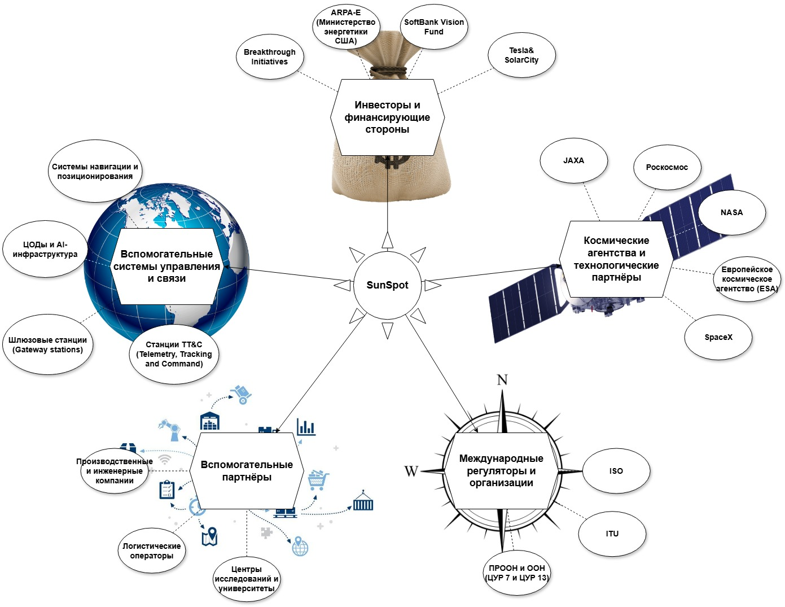
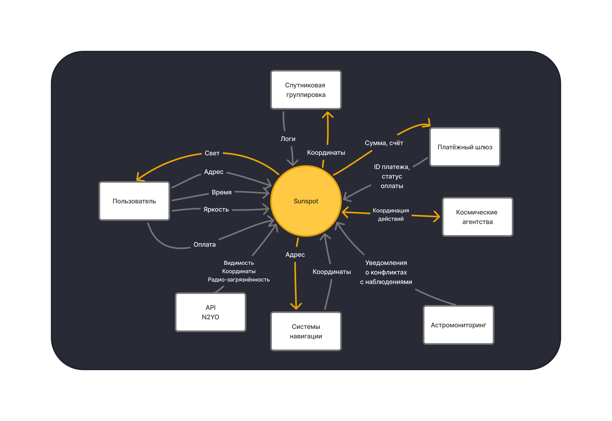

  

  
Sun in your pocket.

  

      
      
  

---  

## Содержание:
<!-- START doctoc generated TOC please keep comment here to allow auto update -->
<!-- DON'T EDIT THIS SECTION, INSTEAD RE-RUN doctoc TO UPDATE -->

- [Введение](#%D0%92%D0%B2%D0%B5%D0%B4%D0%B5%D0%BD%D0%B8%D0%B5)
- [Использование](#%D0%98%D1%81%D0%BF%D0%BE%D0%BB%D1%8C%D0%B7%D0%BE%D0%B2%D0%B0%D0%BD%D0%B8%D0%B5)
- [Технология](#%D0%A2%D0%B5%D1%85%D0%BD%D0%BE%D0%BB%D0%BE%D0%B3%D0%B8%D1%8F)
- [Цели стартапа](#%D0%A6%D0%B5%D0%BB%D0%B8-%D1%81%D1%82%D0%B0%D1%80%D1%82%D0%B0%D0%BF%D0%B0)
- [Команда](#%D0%9A%D0%BE%D0%BC%D0%B0%D0%BD%D0%B4%D0%B0)
- [Конкуренты](#%D0%9A%D0%BE%D0%BD%D0%BA%D1%83%D1%80%D0%B5%D0%BD%D1%82%D1%8B)
  - [Похожие проекты](#%D0%9F%D0%BE%D1%85%D0%BE%D0%B6%D0%B8%D0%B5-%D0%BF%D1%80%D0%BE%D0%B5%D0%BA%D1%82%D1%8B)
  - [Прямые конкуренты](#%D0%9F%D1%80%D1%8F%D0%BC%D1%8B%D0%B5-%D0%BA%D0%BE%D0%BD%D0%BA%D1%83%D1%80%D0%B5%D0%BD%D1%82%D1%8B)
  - [Отличие SunSpot от конкурентов](#%D0%9E%D1%82%D0%BB%D0%B8%D1%87%D0%B8%D0%B5-sunspot-%D0%BE%D1%82-%D0%BA%D0%BE%D0%BD%D0%BA%D1%83%D1%80%D0%B5%D0%BD%D1%82%D0%BE%D0%B2)
- [Основные бизнес-процессы](#%D0%9E%D1%81%D0%BD%D0%BE%D0%B2%D0%BD%D1%8B%D0%B5-%D0%B1%D0%B8%D0%B7%D0%BD%D0%B5%D1%81-%D0%BF%D1%80%D0%BE%D1%86%D0%B5%D1%81%D1%81%D1%8B)
  - [Проектирование спутников](#%D0%9F%D1%80%D0%BE%D0%B5%D0%BA%D1%82%D0%B8%D1%80%D0%BE%D0%B2%D0%B0%D0%BD%D0%B8%D0%B5-%D1%81%D0%BF%D1%83%D1%82%D0%BD%D0%B8%D0%BA%D0%BE%D0%B2)
  - [Производство спутников](#%D0%9F%D1%80%D0%BE%D0%B8%D0%B7%D0%B2%D0%BE%D0%B4%D1%81%D1%82%D0%B2%D0%BE-%D1%81%D0%BF%D1%83%D1%82%D0%BD%D0%B8%D0%BA%D0%BE%D0%B2)
  - [Запуск и развертывание спутниковой группировки](#%D0%97%D0%B0%D0%BF%D1%83%D1%81%D0%BA-%D0%B8-%D1%80%D0%B0%D0%B7%D0%B2%D0%B5%D1%80%D1%82%D1%8B%D0%B2%D0%B0%D0%BD%D0%B8%D0%B5-%D1%81%D0%BF%D1%83%D1%82%D0%BD%D0%B8%D0%BA%D0%BE%D0%B2%D0%BE%D0%B9-%D0%B3%D1%80%D1%83%D0%BF%D0%BF%D0%B8%D1%80%D0%BE%D0%B2%D0%BA%D0%B8)
  - [Управление спутниками и оптимизация их работы](#%D0%A3%D0%BF%D1%80%D0%B0%D0%B2%D0%BB%D0%B5%D0%BD%D0%B8%D0%B5-%D1%81%D0%BF%D1%83%D1%82%D0%BD%D0%B8%D0%BA%D0%B0%D0%BC%D0%B8-%D0%B8-%D0%BE%D0%BF%D1%82%D0%B8%D0%BC%D0%B8%D0%B7%D0%B0%D1%86%D0%B8%D1%8F-%D0%B8%D1%85-%D1%80%D0%B0%D0%B1%D0%BE%D1%82%D1%8B)
  - [Прием и обработка заказов от пользователей](#%D0%9F%D1%80%D0%B8%D0%B5%D0%BC-%D0%B8-%D0%BE%D0%B1%D1%80%D0%B0%D0%B1%D0%BE%D1%82%D0%BA%D0%B0-%D0%B7%D0%B0%D0%BA%D0%B0%D0%B7%D0%BE%D0%B2-%D0%BE%D1%82-%D0%BF%D0%BE%D0%BB%D1%8C%D0%B7%D0%BE%D0%B2%D0%B0%D1%82%D0%B5%D0%BB%D0%B5%D0%B9)
  - [Оказание услуги освещения](#%D0%9E%D0%BA%D0%B0%D0%B7%D0%B0%D0%BD%D0%B8%D0%B5-%D1%83%D1%81%D0%BB%D1%83%D0%B3%D0%B8-%D0%BE%D1%81%D0%B2%D0%B5%D1%89%D0%B5%D0%BD%D0%B8%D1%8F)
  - [Техническая поддержка](#%D0%A2%D0%B5%D1%85%D0%BD%D0%B8%D1%87%D0%B5%D1%81%D0%BA%D0%B0%D1%8F-%D0%BF%D0%BE%D0%B4%D0%B4%D0%B5%D1%80%D0%B6%D0%BA%D0%B0)
  - [Маркетинг и продвижение](#%D0%9C%D0%B0%D1%80%D0%BA%D0%B5%D1%82%D0%B8%D0%BD%D0%B3-%D0%B8-%D0%BF%D1%80%D0%BE%D0%B4%D0%B2%D0%B8%D0%B6%D0%B5%D0%BD%D0%B8%D0%B5)
- [Заинтерисованные лица](#%D0%97%D0%B0%D0%B8%D0%BD%D1%82%D0%B5%D1%80%D0%B8%D1%81%D0%BE%D0%B2%D0%B0%D0%BD%D0%BD%D1%8B%D0%B5-%D0%BB%D0%B8%D1%86%D0%B0)
  - [Потребности](#%D0%9F%D0%BE%D1%82%D1%80%D0%B5%D0%B1%D0%BD%D0%BE%D1%81%D1%82%D0%B8)
  - [Требования](#%D0%A2%D1%80%D0%B5%D0%B1%D0%BE%D0%B2%D0%B0%D0%BD%D0%B8%D1%8F)
- [Требования системы](#%D0%A2%D1%80%D0%B5%D0%B1%D0%BE%D0%B2%D0%B0%D0%BD%D0%B8%D1%8F-%D1%81%D0%B8%D1%81%D1%82%D0%B5%D0%BC%D1%8B)
  - [Функциональные требования](#%D0%A4%D1%83%D0%BD%D0%BA%D1%86%D0%B8%D0%BE%D0%BD%D0%B0%D0%BB%D1%8C%D0%BD%D1%8B%D0%B5-%D1%82%D1%80%D0%B5%D0%B1%D0%BE%D0%B2%D0%B0%D0%BD%D0%B8%D1%8F)
  - [Нефункциональные требования](#%D0%9D%D0%B5%D1%84%D1%83%D0%BD%D0%BA%D1%86%D0%B8%D0%BE%D0%BD%D0%B0%D0%BB%D1%8C%D0%BD%D1%8B%D0%B5-%D1%82%D1%80%D0%B5%D0%B1%D0%BE%D0%B2%D0%B0%D0%BD%D0%B8%D1%8F)
- [Границы системы](#%D0%93%D1%80%D0%B0%D0%BD%D0%B8%D1%86%D1%8B-%D1%81%D0%B8%D1%81%D1%82%D0%B5%D0%BC%D1%8B)
  - [Внешние системы](#%D0%92%D0%BD%D0%B5%D1%88%D0%BD%D0%B8%D0%B5-%D1%81%D0%B8%D1%81%D1%82%D0%B5%D0%BC%D1%8B)
  - [Обмен данными с внешними системами](#%D0%9E%D0%B1%D0%BC%D0%B5%D0%BD-%D0%B4%D0%B0%D0%BD%D0%BD%D1%8B%D0%BC%D0%B8-%D1%81-%D0%B2%D0%BD%D0%B5%D1%88%D0%BD%D0%B8%D0%BC%D0%B8-%D1%81%D0%B8%D1%81%D1%82%D0%B5%D0%BC%D0%B0%D0%BC%D0%B8)
- [MVP](#mvp)
- [Подсистемы и их компоненты](#%D0%9F%D0%BE%D0%B4%D1%81%D0%B8%D1%81%D1%82%D0%B5%D0%BC%D1%8B-%D0%B8-%D0%B8%D1%85-%D0%BA%D0%BE%D0%BC%D0%BF%D0%BE%D0%BD%D0%B5%D0%BD%D1%82%D1%8B)
  - [Спутники и управление ими](#%D0%A1%D0%BF%D1%83%D1%82%D0%BD%D0%B8%D0%BA%D0%B8-%D0%B8-%D1%83%D0%BF%D1%80%D0%B0%D0%B2%D0%BB%D0%B5%D0%BD%D0%B8%D0%B5-%D0%B8%D0%BC%D0%B8)
- [Финансовая модель](#%D0%A4%D0%B8%D0%BD%D0%B0%D0%BD%D1%81%D0%BE%D0%B2%D0%B0%D1%8F-%D0%BC%D0%BE%D0%B4%D0%B5%D0%BB%D1%8C)
- [Безопасность проекта](#%D0%91%D0%B5%D0%B7%D0%BE%D0%BF%D0%B0%D1%81%D0%BD%D0%BE%D1%81%D1%82%D1%8C-%D0%BF%D1%80%D0%BE%D0%B5%D0%BA%D1%82%D0%B0)
- [Вдохновение](#%D0%92%D0%B4%D0%BE%D1%85%D0%BD%D0%BE%D0%B2%D0%B5%D0%BD%D0%B8%D0%B5)

<!-- END doctoc generated TOC please keep comment here to allow auto update -->

---  

## Введение

Свет Солнца содержит в 24 трлн раз больше энергии, чем человечество использует сегодня. Это неисчерпаемый источник.  
Суть проекта - разработка технологии, которая обеспечит солнечным светом любую точку мира вне зависимости от времени года и суток.  
Планируется разместить искуственные спутники-отражатели на орбите Земли.

---  

## Использование

Выработку солнечной энергии нельзя поддержать или продлить, ведь Солнце скрывается ночью, в пасмурную погоду, и его меньше в зимнее время года.
Если бы солнечный свет был доступен постоянно, это открыло бы для человечества бесконечную, недорогую и чистую энергию.  
Для "заказа света" понадобится мобильное приложение/сайт. Достаточно будет указать геопозицию и нажать кнопку подтверждения.

---  

## Технология
  
| Количество спутников    | 57           |
|-------------------------|--------------|
| Размеры спутника        | 10 х 10 м.   |
| Масса спутника          | ~15 кг.      |
| Диаметр солнечного луча | до 150 м.    |
| Выработка энергии       | 600 Вт       |  

На орбиту будет выведено порядка 57 спутников-зеркал, площадью 10 Х 10 метров.
Орбита проходит с севера на юг над полярными областями планеты на высоте 600км.
От одного такого спутника можно получить 600 Вт солнечной энергии на кв.м. солнечной панели.
Масса спутника ~15 кг.
Диаметр луча до 150 метров.  

---  

## Цели стартапа

| Цель | Критерий достижения |
|:-----|:--------------------|
| Запуск сервиса SunSpot к концу первого года разработки | Публикация приложения в Интернете, Google Play, App Store и Rustore   |
| Финансовая окупаемость проекта в течение 12 месяцев после запуска MVP | Достижение 500.000 активных пользователей в течение первых 12 месяцев |
| Увеличить масштаб и качество проекта | Увеличение группировки спутников в 2 раза, а точности позиционирования на 20% |
| Привлечение новых инвестиций | 20 млн. $ инвестиций до выхода на рынок |  

---  

## Команда

* Руслан Арибжанов - web-дизайнер  
* Ойкин Даниил - CTO  
* Степан Герасимов - CEO  
* Александр Чижов - финансист, маркетолог  
* Константин Булгаков - web-разработчик  
* Вячеслав Широков - аэрокосмический инженер  
* Матвей Толкачёв - инженер по производству  
* Вячеслав Захаров - оптический инженер  

---  

## Конкуренты

### Похожие проекты

- **Project Loon (США, Google)** – воздушные шары для интернета, использующие атмосферные системы.
- **Starlink (США, SpaceX)** – спутниковый интернет с глобальным покрытием.
- **Искусственная Луна (Китай, Чэнду)** - Освещение Земли с помощью отражения солнечного света

### Прямые конкуренты

1. **Космическая солнечная электростанция (Китай)**

Организация: Китайская академия космических технологий (CAST).  

Цель: Обеспечить Землю бесперебойной солнечной энергией путём сбора её в космосе и передачи на поверхность.  

Ход реализации:  
Ведётся активная разработка.  
Первый демонстрационный спутник (10 кВт) запланирован к запуску в 2028 году на низкую орбиту.  
К 2030 году — запуск мощной станции на геостационарную орбиту (до 1 МВт)  
К 2035 году — развертывание крупной мегаваттной станции  

Текущий прогресс: успешно проведены наземные испытания беспроводной передачи энергии (на 300 метров с помощью микроволн)  

Основные функции и характеристики: 
- Наземная передача энергии на 300 м (микроволны)   
- Инфраструктура тестирования  

2. **Проект SOLARIS (ESA, Европа)**

Организация: Европейское космическое агентство (ESA)  

Цель: Разработка технологии для сбора солнечной энергии на орбите и передачи на Землю  

Ход реализации:  
В 2022–2023 годах ESA заключило контракты с компаниями на проведение исследовательских работ  
В рамках программы в Германии успешно проведена демонстрация беспроводной передачи энергии (на 36 метров)  
Идёт подготовка к созданию прототипа станции  

Текущий прогресс: создание тестовых моделей антенн и беспроводной передачи энергии  

Основные функции и характеристики: 
- Демонстрация беспроводной передачи на 36 м
- Контракты с частными разработчиками  

3. **Программа космических экспериментов «Знамя» (Россия, Роскосмос)**

Организация: Российское космическое агентство (Роскосмос)  

Цель: Исследование возможностей освещения северных регионов Земли с помощью отражённого солнечного света от орбитальных зеркал

Ход реализации:
- Первый экспериментальный запуск «Знамя-1» состоялся в 1993 году и прошёл успешно  
- В 1999 году был запущен аппарат «Знамя-2.5», однако из-за технических неполадок зонт не раскрылся полностью  
- Проект «Знамя-3» был запланирован, но отменён из-за недостатка финансирования и международной критики

Текущий прогресс: проект заморожен

Основные функции и характеристики:
- Раскрывающееся орбитальное зеркало диаметром до 25 метров  
- Отражение солнечного света на поверхность Земли для увеличения светового дня в северных широтах  
- Использование технологии из космических солнечных парусов

### Отличие SunSpot от конкурентов

- Работа со всеми категориями потребителей (физ.лица, компании, государственные и международные организации).
- Мобильное приложение с платным управлением света.
- Точное позиционирование для освещения малых зон.
- Использование микросатов (маленьких спутников) с простой и дешёвой конструкцией.
- Интеграция с XR: визуализация света и прогноза.

---  

## Основные бизнес-процессы

### Проектирование спутников  

**Действующие лица:** Инженеры, конструкторы.  
**В каком случае / Когда:** При создании новой модели спутника (в т.ч. первой).  
**Условия / Ограничения:** Ограничения по бюджету, срокам, характеристики материалов, требования к массе/габаритам от провайдера ракетных запусков.  
**Шаги / Действия:**  
- Подбор готовых узлов и деталей.
- Проектирование конструкции спутника.  
- Расчёт инженерных характеристик.  
- Написание документации.
- Изготовление собственных узлов и деталей.  
- Сборка прототипов.  
- Испытание тестовых образцов.  

**Ресурсы:**  
- Компьютерные системы с математическими пакетами, офисными и CAD программами, производственные мощности для прототипирования (3D принтеры), испытательные стенды.  
- Готовые узлы, детали и материалы (зеркальные плёнки, карбон, солнечные батареи и т.п.).

**Результат:** Инженерная модель, расчёты, документация и неколько тестовых образцов.  

### Производство спутников  

**Действующие лица:** Производственный отдел.  
**В каком случае / Когда:** При создании изначальной группировки или её расширении.  
**Условия / Ограничения:** Ограничения по бюджету, материалам, срокам и требованиям к массе/габаритам.  
**Шаги / Действия:**  
- Собирает спутник в соответсвии с инженерной моделью.
- Проводит стендовые испытания.

**Ресурсы:**  
- CAD-системы, производственные комплексы, испытательные стенды.  
- Материалы (зеркальные плёнки, карбон, солнечные батареи).

**Результат:** Готовый к запуску спутник с сертификацией.  

### Запуск и развертывание спутниковой группировки  

**Действующие лица:** Отдел запусков, партнеры (Космические агентства или компании).  
**В каком случае / Когда:** При необходимости вывода новых спутников или замены старых.  
**Условия / Ограничения:** График пусков, погода, разрешения.  
**Шаги / Действия:**  
- Заключает контракты на запуск.  
- Интегрирует спутники в ракету-носитель.  
- Контролирует вывод на орбиту.  

**Ресурсы:** Ракеты, страховка, телеметрия.
**Результат:** Спутник на целевой орбите, готовый к работе.   

### Управление спутниками и оптимизация их работы  

**Действующие лица:** Операторы ЦУПа.  
**В каком случае / Когда:**  После вывода группировки спутников - постоянно (24/7).  
**Ограничения:** Задержка сигнала, заряд батарей, положение Солнца.  
**Шаги / Действия:**  
- Рассчитывает траекторию отражения света.  
- Корректирует угол зеркал в реальном времени.  
- Передает данные в приложение.

**Ресурсы:** Компьютерные алгоритмы, телеметрия со спутников.  
**Результат:** Точное попадание луча в заданную точку.  

### Прием и обработка заказов от пользователей  

**Действующие лица:** Мобильное приложение, серверы, платежные системы.  
**В каком случае / Когда:** Когда пользователь делает запрос.  
**Ограничения:** Гео-блоки, погода, занятость спутников.  
**Шаги / Действия:**  
- Проверяет доступность спутников.  
- Рассчитывает стоимость.  
- Подтверждает бронь. 

**Ресурсы:** Карты, API платежей, база данных.  
**Результат:** Заказ с координатами и временем.  

### Оказание услуги освещения  

**Действующие лица:** Автоматика спутника + ЦУП.  
**В каком случае / Когда:** В момент активации заказа.  
**Ограничения:** Облачность, запрещенные зоны (аэропорты).  
**Шаги / Действия:**  
- Разворачивает зеркало.  
- Держит луч заданное время.  
- Фиксирует успешность выполнения.
  
**Ресурсы:** Датчики, гироскопы, солнечные сенсоры.  
**Результат:** Освещенная область на Земле.  

### Техническая поддержка  

**Действующие лица:** Колл-центр, чат-боты.  
**В каком случае / Когда:** При жалобах или сбоях.  
**Ограничения:** Время реакции, языковой барьер.  
**Шаги / Действия:**  
- Возвращает деньги за сбой.  
- Объясняет, почему луч не сработал (например, тучи).
   
**Ресурсы:** База знаний, скрипты.  
**Результат:** Довольный или компенсированный клиент.  

### Маркетинг и продвижение  

**Действующие лица:** Отдел маркетинга, SMM-специалисты.  
**В каком случае / Когда:** Постоянно + пиар-акции.  
**Ограничения:** Бюджет, этика (световое загрязнение).  
**Шаги / Действия:**  
- Запускает рекламу в соцсетях.  
- Организует креативные события для СМИ.
  
**Ресурсы:** Креативы, инфлюенсеры.  
**Результат:** Рост числа пользователей.  

---  

## Заинтерисованные лица

### Потребности

Владельцы продукта:
- Владельцы SunSpot - успешный жизненный цикл проекта.  

Команда продукта:
- Команда SunSpot - устойчивое развитие проекта для сохранения рабочих мест.  

Инвесторы:
- Акционеры и инвесторы (Венчурные инвестиционные фонды, Бизнес-ангелы и др.) – получение высокой прибыли при высоком риске.  

Партнёры:
- Производители компонентов - расширение клиентской базы и получение прибыли.
- Космические агентства (NASA, ESA, Роскосмос, CNSA и др.) и космические компании (SpaceX, Blue Origin, OneWeb и др.) – расширение клиентской базы и получение прибыли, партнёрство в разработке и размещении инновационных космических технологий.  

Пользователи:
- Сельскохозяйственные корпорации и фермеры – увеличение продолжительности светового дня для повышения среднегодовой урожайности.
- Владельцы солнечных электростанций – увеличение выхода электричества от солнечных панелей.
- Жители северных регионов – продление светового дня зимой.
- Аудитория (потребители контента) – улучшение качества рекреационной деятельности (кемпинга, мероприятий на открытом воздухе и т.п.) и создание интересного опыта.
- Коммунальные службы, министерства энергетики и организаторы крупных мероприятий – уменьшение расходов на освещение крупных площадей или предоставление освещения в труднодоступных местах.  
- МЧС и поисково-спасательные отряды - освещение места событий для лёгкого поиска пострадавших.
- Силовые структуры (МВД, Спецслужбы, Армия) – разведка, освещение места событий для нивелиирования тактического преимущества врага, воздействие на личный состав и материальную базу противника в любой точке мира, в любое время суток. 
- Университеты и лаборатории – изучение воздействия подобного источника света на разные вещи и явления.
- Организации с экологическоми программами (Министерства, Гринпис, ООН, Всемирный банк  и др.) – лоббирование альтернативной энергетики и связанных технологий для борьбы с изменением климата и загрязнение окружающей среды.

### Требования

| Группа | Потребности | Требования |
| :----------------------- | :---------- | :--------- |
| Владельцы продукта | Успешный запуск, монетизация, рост пользовательской базы | Минимизация затрат, быстрая разработка, масштабируемость |
| Команда продукта | Четкие требования, удобная архитектура, минимизация багов | Подробное техническое задание, API-ориентированная архитектура |
| Инвесторы | Рост метрик, минимизация рисков, максимизация прибыли | Понятная дорожная карта, прогнозируемый рост |
| Партнёры | Легкая интеграция, доступ к заказам и аналитике, расшрение клиенткой базы | Наличие публичного API, безопасность данных |
| Пользователи | Интуитивное использование, уникальный опыт, безопасность платежей | Удобный интерфейс, стабильная работа, гарантированная обработка заказов |

---  

## Требования системы

### Функциональные требования

- Регистрация и аутентификация пользователей через email/социальные сети.
- Интерактивная карта для выбора точки назначения луча.
- Механизм оформления и оплаты заказа через интеграцию с платежными системами.
- Визуализация луча (анимация) в реальном времени при активации заказа.
- Панель администратора для мониторинга заказов и управления данными пользователей.
- Отправка уведомлений пользователям о статусе их заказа.
- Система отзывов и рейтингов.
- История заказов пользователей.

### Нефункциональные требования

**Атрибуты качества:**
- Высокая производительность (время отклика сервера <1 секунды).
- Надежность работы (доступность системы 99,9%).
- Защита пользовательских данных в соответствии с GDPR.
- Масштабируемость инфраструктуры.

**Ограничения:**
- Стартовая поддержка только мобильных платформ (iOS и Android).
- Первичная реализация эффекта луча — виртуальная анимация.
- Ограниченный стартовый бюджет на инфраструктуру и маркетинг.

---  

## Границы системы

### Внешние системы
             

- Спутниковая сеть управления (NASA, SpaceX, ESA)
- Платёжные системы (Stripe, PayPal)
- Мобильные платформы (iOS, Android)
- Метеорологические системы (метеорологические датчики и климатические прогнозы)
- Информационные технологии (облачные платформы и IoT-платформы)
- Картографические сервисы (Google Maps или OpenStreetMap)
- Сервисы аналитики (Google Analytics)
- Социальные сети и маркетинг
- Финансовые системы

--- 
### Обмен данными с внешними системами

| Внешняя система            | Данные                             |
|----------------------------|----------------------------------------|
| Пользователь               | Адрес Время Яркость Оплата Свет |
| Спутниковая группировка    | Логи Координаты|
| API N2YO https://www.n2yo.com/api/ | Видимость Координаты Радио-загрязнённость |
| Системы навигации          | Адрес Координаты |
| Астромониторинг            | Уведомления о конфликтах с наблюдениями |
| Платёжный шлюз             | Сумма Счёт ID платежа Статус оплаты|
| Космические агентства      | Координация действий |  

    

--- 
## MVP

MVP проекта включает:
- Регистрацию и авторизацию пользователей
- Карту для выбора точки назначения луча
- Оформление заказа и интеграцию оплаты через сторонние платежные системы
- Визуализацию виртуального луча в выбранной точке на карте
- Отправку уведомлений пользователю о статусе заказа
- Базовую панель администратора для мониторинга заказов

---  

## Подсистемы и их компоненты

Мы выделили подсистемы на основании их физического проявления.

### Спутники и управление ими

**Центральный сервер управления спутниками**

Функции: 
- Принимает команды на освещение от внешней системы через API
- Определяет оптимальный спутник (или несколько) для выполнения задачи, основываясь на орбитальных данных
- Формирует управляющие команды, обрабатывает запросы (направление зеркал, время активации, продолжительность работы)
- Аутентификация пользователей, проверка доступности спутников
- Коммуникация с другими внешними системами (база данных, модуль связи со спутником)

Ограничения:
- Ограничение кол-ва запросов (10000 в день)
- В режиме реального времени необходимо учитывать орбитальное положение солнечную засветку облачность, энергоресурсы спутников
- Плохая спутниковая связь, неточное позиционирование спутников (отклонение по градусам 20-30°)

Качественные характеристики:
- Надежность: разделение большой группы данных по определённым критериям
- Производительность: обслуживание более 100 пользователей одновременно
- Расширяемость: добавление новых спутников, модулей, кол-во запросов в день
- Безопасность: oauth2 протокол аутентификации, использование https 
- Масштабируемость: добавление новых режимов работы  

**Модуль связи со спутником (наземный)**

Функции: 
- Расчет позиционирования спутников
- Отправка управляющих команд на спутники (активация/деактивация.команды ориентации)
- Приём телеметрии со спутников (статус зеркал. координаты, скорость, заряд и тп)
- Поддержка связи с базой данных и центральным сервером управления спутников  

Ограничения:
- Ограничение связи, пропускной способности (радиочастотная связь, gps, спутниковаятелефонная связь)
- Погодные условия
- Должны быть соблюдена синхронизация с работой других систем  
  
Качественные характеристики:
- Надежность: Надежные протоколы передачи данных, резервирование узлов, возможность ручного ввода
- Производительность: быстрая обработка данных (примерно 5 секунд), одновременная связь с несколькими спутниками ( до 10 спутников), 
- Безопасность: Шифрование команд (aes 256), логирование передачи данных, 
- Масштабируемость: Увеличение количества управляющих модулей
- Расширяемость: Улучшение шифрования, дополнительная защита передаваемых данных
- Доступность: 24/7  

**База данных**

Функции: 
- Хранение пользовательских данных
- Хранение истории активности (спутника, модуля управления и сервера)
- Хранение логов работы спутника (конкретная информация спутников)
- Обеспечение целостности данных  

Ограничения:
- Должна быть зашифрована, с ограниченным доступом
- Ограничение объёма данных (100 тб в год)

Качественные характеристики:
- Безопасность: разграничение доступа, шифрование важных данных
- Надежность: Наличие резервных копий, возможность отката
- Масштабируемость: Умная сортировка данных, больше серверов
- Производительность: Обработка параллельных операций
- Доступность: в случае выходы из строя основной базы данных резервная берет на себя выполнение всех функций основной

**Спутники**

Функции:
- Выполнение команд (отражение преломляемых лучей, поворот зеркал, отключение)
- Автономная навигация, ориентация, стабилизация, корректировка угла
- Передача телеметрии на Землю
- Поддержка связи с модулем связи спутников

Ограничения:
- Ограничение питания, питание от солнечных панелей, ограниченное время ночью (малый срок резервного питания от встроенного аккумулятора)
- Подвержен старению компонентов
- Суровые условия работы ( возможность столкновение с астероидами, выход с орбиты)
- Запрещённые зоны для освещения (юридические ограничения)
 
Качественные характеристики:  
- Надежность: резервные системы управления спутника  
- Доступность: при каждом проявлении связи с Землей  
- Производительность: Выполнение команд в течение нескольких секунд, точность направленного луча до 150 метров от указанной точки  
- Расширяемость: обновление ПО удаленно, возможность самодиагностики и исправления ошибок  
- Безопасность: наличие защищённых каналов связи  

---

## Финансовая модель

**Общие параметры:**
- Всего будет запущено **57 спутников**
- Для одного луча необходимо ~**3 спутника** → максимум **19 лучей**
- Пример спутника-фундамента: **CubeSat 3U** (~100 000 $)

**Запуск спутников:**
- Программа запуска **Rideshare от SpaceX**  
- Стоимость запуска: `6 500 $ * 15 кг = 97 500 $` на один спутник  
- Примерный итог (производство + запуск):  
  `197 500 $ * 57 спутников = 11 257 500 $`

**Инфраструктура:**
- Поддержка наземных станций, ПО, связи и электропитания спутников, разработка приложения  
- Примерно: **100 000 $**

**Постоянные затраты:**
- Зарплаты сотрудников  
- Оплата связи и тарифов за электропитание  
Итого ежемесячно: **~40 000 $**

**Общий итог:**
**11 397 500 $** (включая запуск, производство, инфраструктуру и начальные затраты)

**Модель монетизации:**
- В день 1 луч стоит **555 $**
- Один пользователь может использовать **минимум 1 часа в день**
- Оставшиеся часы могут использовать другие пользователи

**Расчёт использования:**
- `19 лучей * 30 дней * 36 месяцев = 20 520` (использований лучей за 3 года)
- `11 397 500 $ / 20 520 ≈ 555 $` — цена **одного луча в день**
- `555 $ / 24 ч ≈ 23,2 $` — цена **одного луча в час**

---

## Безопасность проекта

Пользователи будут иметь свои уровни авторизации, определяющие их возможности и ограничения по количеству наводимых спутников (в целом, одновременно в одну точку), доступным зонам и времени наведения на цель.  

Сами спутники могут иметь ограничения в прошивке, например определяющие максимальное время выполнения одного задания по ориентации.
Данные будут передаваться по зашифрованным каналам с возможностью использовать корпоративную сеть передатчиков.  

Так как сам спутник не выполняет расчёта ориентации, а только принимает команды с земли, то от взломщиков требуется знать алгоритм расчёта ориентации для направленного зловредного использования. Кроме того алгоритмы управления очередью целей следят за историей применения спутников и не допустят многократного наведения луча в одно и то же место, даже если запрос поступал от разных клиентов.  

В крайнем случае, при взлом или потере управления над спутником его можно прожечь или отклонить с помощью очень мощного лазера, направленного в майларовый отражатель.

---

## Описание сценариев использования

Ключевым сценарием использования является:  
**Прием и обработка заказа на освещение**  

**Действующие лица (Actors):**  
- __Пользователь__  
- __Центральный сервер управления спутниками__

**Предусловия:**  
- Пользователь аутентифицирован и имеет право на подачу заказов.  
- Центральный сервер управления спутниками функционирует и готов к приему запросов.

**Основной поток событий:**  
1. Пользователь отправляет запрос на освещение через API, указывая параметры (координаты, время, продолжительность).  
2. Центральный сервер принимает запрос и проверяет его валидность (например, корректность координат и доступность времени).  
3. Сервер анализирует орбитальные данные и состояние спутников, выбирая оптимальный спутник для выполнения заказа.  
4. Сервер формирует управляющие команды для выбранного спутника.  
5. Сервер передает команды в модуль связи со спутником.  
6. Модуль связи отправляет команды на спутник.  
7. Спутник выполняет команды и отправляет подтверждение выполнения через модуль связи.  
8. Сервер обновляет статус заказа в базе данных и уведомляет пользователя о выполнении.

**Постусловия:**  
- Заказ на освещение выполнен, данные о выполнении сохранены в базе данных.  
- Пользователь получил уведомление о результате.  

**Используемые данные**  
- __User__: Данные пользователя (ID, аутентификационные токены).  
- __Order__: Данные заказа (координаты, время, продолжительность).  
- __SatelliteOrbit__: Орбитальные данные спутников (позиция, траектория).  
- __SatelliteStatus__: Текущее состояние спутников (доступность, заряд, положение зеркал).  
- __ControlCommand__: Команды управления (инструкции для спутника).  

**Затрагиваемые компоненты архитектуры**  
- __Центральный сервер управления спутниками__ (обработка запросов, выбор спутника).  
- __Модуль связи со спутником__ (передача команд).  
- __База данных__ (хранение данных о заказах и спутниках).  
- __Спутник__ (выполнение команд).  

**Обоснование характеристик**  
- __Производительность__: Обработка запроса занимает менее 1 секунды благодаря оптимизированному алгоритму выбора спутника и быстрой передаче данных.  
- __Надёжность__: Резервирование узлов сервера и надёжные протоколы передачи (например, TCP) гарантируют выполнение заказа даже при частичных сбоях.  
- __Безопасность__: Аутентификация через OAuth2 и шифрование команд (AES-256) защищают от несанкционированного доступа.  

---

## Описание сценариев ошибок

1. **Технический сбой спутника**
- Условия возникновения:
один или несколько наших спутников на орбите, вышло из строя: невозможно скорректировать зеркало, потеря связи, ошибка датчиков
- Реакция системы:
система проверияет работоспособность каждого из наших спутников. Если спутник не отвечает на сигнал или отвечает неккоректно, можно сделать вывод, что спутник не исправен. Если данные со спутника всё же поступают, но они неккоректы, системы проведем анализ компонентов спутника и найдет ошибку. Если данные не поступают, система автоматически исключает спутник из текущей траектории, если возможно, активируется резервный спутник. Ошибка отправляется в техподдержку и фиксируется в логах.
- Влияние на данные/архитектуру:
требуется резервирование спутников в сеансе освещения.
В архитектуре появляется подсистема диагностики и отказоустойчивости.

2. **Некорректные координаты цели**
- Условия возникновения:
пользователь вводит координаты, находящиеся за пределами досягаемости спутников: запрашиваемая зона освещения находится в зоне ночной тени, на территории с ограничениями.
- Реакция системы:
пользователь получает сообщение: "Выбранная точка недостижима. Попробуйте выбрать другое местоположение."
Запись не сохраняется.
ошибка логируется.
- Влияние на данные/архитектуру:
требуется валидация координат на этапе создания сеанса освещения.
Нужен модуль геоаналитики для определения достижимости точки на основе текущих спутников и времени.
Архитектура дополняется компонентом предварительной проверки доступности.

3. **Спутники недоступны в запрошенное время**
- Условия возникновения:
пользователь выбирает время, когда ни один из спутников не может обеспечить освещение: нехватка спутников или плохие погодные условия.
- Реакция системы:
сообщение пользователю: "Нет доступных спутников в заданное время / Спутник не может выполнить данный запрос в заданное время из-за погодных условий. Предлагаем выбрать другой интервал." 
Предлагается список ближайших доступных временных окон.
Ошибка записывается в лог.
- Влияние на данные/архитектуру:
планировщик задач должен иметь доступ к актуальному положению всех спутников.
В  сеанс освещения добавляется флаг "отклонён по технической причине".
Модель данных должна учитывать причины отказа.

4. **Недоступность направление  нескольких лучей в одну точку**
- Условия возникновения:
пользователь/пользователи запрашивают единовременно несколько лучей в одну зону освещения.
- Реакция системы:
сообщение пользователю: "В данный момент эта зона уже освещается. Предлагаем выбрать другой интервал."
Ошибка записывается в лог.
- Влияние на данные/архитектуру: при создании нового сеанса система должна проверять, не занят ли этот участок земли в выбранное время.
В базе данных сеанс освещения должно быть поле с координатами и временем — чтобы можно было сравнивать с другими заявками.
Архитектура должна уметь быстро проверять пересечения по времени и месту, чтобы не было конфликтов между пользователями.

---

## Ранжирование вариантов использования

| № | Приоритет | Use Case | Обоснование |
|---|---|---|---|
| 1 | Must Have | Сформировать заказ на освещение и оплатить | Ключевая функция продукта. Без создания заказа система не имеет ценности для пользователя. Основа монетизации. Прямо влияет на возможность получения дохода. |
| 2 | Must Have | Проверить валидность заказов | Критически для безопасности и корректности. Автоматическая проверка координат (доступность, запрещенные зоны) обязательна перед исполнением. |
| 3 | Must Have | Добавить заказ в очередь | Основной системный процесс. Связывает пользовательский интерфейс с системой управления спутниками. |
| 4 | Should Have | Проверить статус заказа | Важно для UX. Позволяет пользователю отслеживать этапы выполнения заказа (принят, в процессе, выполнен). |
| 5 | Should Have | Отменить заказ | Гибкость для пользователя. Важно, но можно ограничить отмену только до момента передачи команды спутникам. |
| 6 | Should Have | Написать в техподдержку | Базовая поддержка пользователей. На MVP можно реализовать через простую контактную форму. |
| 7 | Could Have | Редактировать личный аккаунт | Удобство пользователя. Смена имени, email и т.д. Не критично для первичной функциональности. |
| 8 | Could Have | Просмотреть выполненный заказ | История операций. Полезная функция, но не обязательная для первого релиза. |
| 9 | Could Have | Оставить отзыв | Обратная связь и социальное доказательство. Можно добавить после подтверждения гипотез MVP. |
| 10 | Could Have | Отследить выполнение заказов | Мониторинг для оператора. На MVP можно использовать базовые логи вместо сложной системы отслеживания. |
| 11 | Will Not Have | Отследить появление проблем у пользователей | Продвинутая аналитика. Можно отложить до сбора статистики использования MVP. |
| 12 | Will Not Have | Решить ключевые проблемы пользователей | Расширенная поддержка. Требует сложной тикет-системы, что не нужно на старте. |
| 13 | Will Not Have | Отменить заказ | Возможность клиента отменить действующий заказ. |

---

## Вдохновение

Reflect Orbital: https://www.reflectorbital.com/
