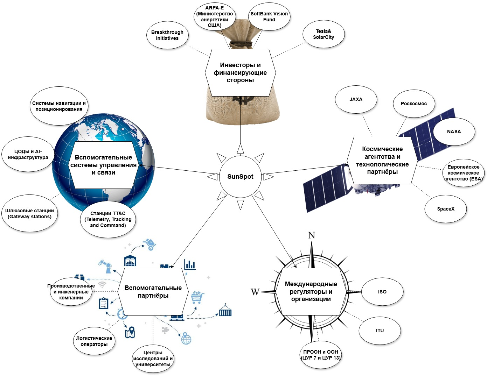

# Концепт SunSpot

## Конкуренты

### Похожие проекты

- **Project Loon (США, Google)** – воздушные шары для интернета, использующие атмосферные системы.
- **Starlink (США, SpaceX)** – спутниковый интернет с глобальным покрытием.
- **Искусственная Луна (Китай, Чэнду)** - Освещение Земли с помощью отражения солнечного света

### Прямые конкуренты

1. **Космическая солнечная электростанция (Китай)**

Организация: Китайская академия космических технологий (CAST).  

Цель: Обеспечить Землю бесперебойной солнечной энергией путём сбора её в космосе и передачи на поверхность.  

Ход реализации:  
Ведётся активная разработка.  
Первый демонстрационный спутник (10 кВт) запланирован к запуску в 2028 году на низкую орбиту.  
К 2030 году — запуск мощной станции на геостационарную орбиту (до 1 МВт)  
К 2035 году — развертывание крупной мегаваттной станции  

Текущий прогресс: успешно проведены наземные испытания беспроводной передачи энергии (на 300 метров с помощью микроволн)  

Основные функции и характеристики: 
- Наземная передача энергии на 300 м (микроволны)   
- Инфраструктура тестирования  

2. **Проект SOLARIS (ESA, Европа)**

Организация: Европейское космическое агентство (ESA)  

Цель: Разработка технологии для сбора солнечной энергии на орбите и передачи на Землю  

Ход реализации:  
В 2022–2023 годах ESA заключило контракты с компаниями на проведение исследовательских работ  
В рамках программы в Германии успешно проведена демонстрация беспроводной передачи энергии (на 36 метров)  
Идёт подготовка к созданию прототипа станции  

Текущий прогресс: создание тестовых моделей антенн и беспроводной передачи энергии  

Основные функции и характеристики: 
- Демонстрация беспроводной передачи на 36 м
- Контракты с частными разработчиками  

3. **Программа космических экспериментов «Знамя» (Россия, Роскосмос)**

Организация: Российское космическое агентство (Роскосмос)  

Цель: Исследование возможностей освещения северных регионов Земли с помощью отражённого солнечного света от орбитальных зеркал

Ход реализации:
- Первый экспериментальный запуск «Знамя-1» состоялся в 1993 году и прошёл успешно  
- В 1999 году был запущен аппарат «Знамя-2.5», однако из-за технических неполадок зонт не раскрылся полностью  
- Проект «Знамя-3» был запланирован, но отменён из-за недостатка финансирования и международной критики

Текущий прогресс: проект заморожен

Основные функции и характеристики:
- Раскрывающееся орбитальное зеркало диаметром до 25 метров  
- Отражение солнечного света на поверхность Земли для увеличения светового дня в северных широтах  
- Использование технологии из космических солнечных парусов

### Отличие SunSpot от конкурентов

- Массовая кастомизация: выбор точки освещения пользователем.
- Мобильное приложение с платным управлением света.
- Гибкое позиционирование с помощью маневренных спутников.
- Точечное освещение малых зон.
- Интеграция с AR/VR: визуализация света и прогноза.

---  

## Основные бизнес-процессы

### **Проектирование спутников**  
**Действующие лица:** Инженеры, конструкторы.  
**В каком случае / Когда:** При создании новой модели спутника (в т.ч. первой).  
**Условия / Ограничения:** Ограничения по бюджету, срокам, характеристики материалов, требования к массе/габаритам от провайдера ракетных запусков.  
**Шаги / Действия:**  
- Подбор готовых узлов и деталей.
- Проектирование конструкции спутника.  
- Расчёт инженерных характеристик.  
- Написание документации.
- Изготовление собственных узлов и деталей.  
- Сборка прототипов.  
- Испытание тестовых образцов.  

**Ресурсы:**  
- Компьютерные системы с математическими пакетами, офисными и CAD программами, производственные мощности для прототипирования (3D принтеры), испытательные стенды.  
- Готовые узлы, детали и материалы (зеркальные плёнки, карбон, солнечные батареи и т.п.).

**Результат:** Инженерная модель, расчёты, документация и неколько тестовых образцов.  

### **Производство спутников**  
**Действующие лица:** Производственный отдел.  
**В каком случае / Когда:** При создании изначальной группировки или её расширении.  
**Условия / Ограничения:** Ограничения по бюджету, материалам, срокам и требованиям к массе/габаритам.  
**Шаги / Действия:**  
- Собирает спутник в соответсвии с инженерной моделью.
- Проводит стендовые испытания.

**Ресурсы:**  
- CAD-системы, производственные комплексы, испытательные стенды.  
- Материалы (зеркальные плёнки, карбон, солнечные батареи).

**Результат:** Готовый к запуску спутник с сертификацией.  

### **Запуск и развертывание спутниковой группировки**  
**Действующие лица:** Отдел запусков, партнеры (Космические агентства или компании).  
**В каком случае / Когда:** При необходимости вывода новых спутников или замены старых.  
**Условия / Ограничения:** График пусков, погода, разрешения.  
**Шаги / Действия:**  
- Заключает контракты на запуск.  
- Интегрирует спутники в ракету-носитель.  
- Контролирует вывод на орбиту.  

**Ресурсы:** Ракеты, страховка, телеметрия.
**Результат:** Спутник на целевой орбите, готовый к работе.   

### **Управление спутниками и оптимизация их работы**  
**Действующие лица:** Операторы ЦУПа.  
**В каком случае / Когда:**  После вывода группировки спутников - постоянно (24/7).  
**Ограничения:** Задержка сигнала, заряд батарей, положение Солнца.  
**Шаги / Действия:**  
- Рассчитывает траекторию отражения света.  
- Корректирует угол зеркал в реальном времени.  
- Передает данные в приложение.

**Ресурсы:** Компьютерные алгоритмы, телеметрия со спутников.  
**Результат:** Точное попадание луча в заданную точку.  

### **Прием и обработка заказов от пользователей**  
**Действующие лица:** Мобильное приложение, серверы, платежные системы.  
**В каком случае / Когда:** Когда пользователь делает запрос.  
**Ограничения:** Гео-блоки, погода, занятость спутников.  
**Шаги / Действия:**  
- Проверяет доступность спутников.  
- Рассчитывает стоимость.  
- Подтверждает бронь. 

**Ресурсы:** Карты, API платежей, база данных.  
**Результат:** Заказ с координатами и временем.  

### **Оказание услуги освещения**  
**Действующие лица:** Автоматика спутника + ЦУП.  
**В каком случае / Когда:** В момент активации заказа.  
**Ограничения:** Облачность, запрещенные зоны (аэропорты).  
**Шаги / Действия:**  
- Разворачивает зеркало.  
- Держит луч заданное время.  
- Фиксирует успешность выполнения.
  
**Ресурсы:** Датчики, гироскопы, солнечные сенсоры.  
**Результат:** Освещенная область на Земле.  

### **Техническая поддержка**  
**Действующие лица:** Колл-центр, чат-боты.  
**В каком случае / Когда:** При жалобах или сбоях.  
**Ограничения:** Время реакции, языковой барьер.  
**Шаги / Действия:**  
- Возвращает деньги за сбой.  
- Объясняет, почему луч не сработал (например, тучи).
   
**Ресурсы:** База знаний, скрипты.  
**Результат:** Довольный или компенсированный клиент.  

### **Маркетинг и продвижение**  
**Действующие лица:** Отдел маркетинга, SMM-специалисты.  
**В каком случае / Когда:** Постоянно + пиар-акции.  
**Ограничения:** Бюджет, этика (световое загрязнение).  
**Шаги / Действия:**  
- Запускает рекламу в соцсетях.  
- Организует креативные события для СМИ.
  
**Ресурсы:** Креативы, инфлюенсеры.  
**Результат:** Рост числа пользователей.  

---  

## Заинтерисованные лица и их потребности

1. Команда SunSpot - развитие проекта для получения прибыли.
2. Партнёры по производству спутников - расширение клиентской базы и получение прибыли.
3. Акционеры и инвесторы (Венчурные инвестиционные фонды, Бизнес-ангелы и др.) – получение высокой прибыли при высоком риске.
4. Сельскохозяйственные корпорации и фермеры – увеличение продолжительности светового дня для повышения среднегодовой урожайности.
5. Владельцы солнечных электростанций – увеличение выхода электричества от солнечных панелей.
6. Жители северных регионов – продление светового дня зимой.
7. Аудитория (потребители контента) – улучшение качества рекреационной деятельности (кемпинга, мероприятий на открытом воздухе и т.п.) и создание интересного опыта.
8. Космические агентства (NASA, ESA, Роскосмос, CNSA и др.) и космические компании (SpaceX, Blue Origin, OneWeb и др.) – расширение клиентской базы и получение прибыли, партнёрство в разработке и размещении инновационных космических технологий.  
9. Коммунальные службы, министерства энергетики и организаторы крупных мероприятий – уменьшение расходов на освещение крупных площадей или предоставление освещения в труднодоступных местах.  
10. МЧС и поисково-спасательные отряды - освещение места событий для лёгкого поиска пострадавших.
11. Силовые структуры (МВД, Спецслужбы, Армия) – разведка, освещение места событий для нивелиирования тактического преимущества врага, воздействие на личный состав и материальную базу противника в любой точке мира, в любое время суток. 
12. Университеты и лаборатории – изучение воздействия подобного источника света на разные вещи и явления.
13. Организации с экологическоми программами (Министерства, Гринпис, ООН, Всемирный банк  и др.) – лоббирование альтернативной энергетики и связанных технологий для борьбы с изменением климата и загрязнение окружающей среды.

---  

## Границы системы

### Внешние системы
             

  

- Спутниковая сеть управления (NASA, SpaceX, ESA)
- Платёжные системы (Stripe, PayPal)
- Мобильные платформы (iOS, Android)
- Метеорологические системы (метеорологические датчики и климатические прогнозы)
- Информационные технологии (облачные платформы и IoT-платформы)
- Геолокационные сервисы (GPS, Глонасс)
- Социальные сети и маркетинг
- Финансовые системы

### Обмен данными с внешними системами

| Внешняя система            | Тип данных                             |
|----------------------------|----------------------------------------|
| Метеорологические системы  | Метеорологические данные Климатические прогнозы Данные о метеорологических явлениях |
| Информационные технологии  | Данные о пользователях Данные об использовании приложения API интеграции |
| Геолокационные сервисы     | Геолокационные данные Данные о маршрутах спутников Картографические данные |
| Социальные сети и маркетинг | Маркетинговые данные Обратная связь от пользователей |
| Финансовые системы         | Данные о транзакциях Финансовые отчеты Данные о подписках |
